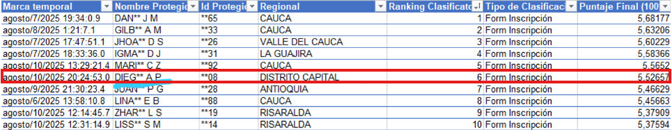

# 🚀 Road to SENASoft 2025   

---

## 🏆 Reconocimiento especial  

🥇 **Mejor aprendiz de Distrito Capital en SENASoft 2025**  
Un logro que refleja esfuerzo, disciplina y pasión por la tecnología.  



---

## 🌟 Sobre mí  

Soy Diego Alejandro Paloma Diaz, aprendiz del SENA apasionado por la tecnología y la innovación.  
Este repositorio documenta mi camino en la hackathon **SENASoft 2025**, desde la inscripción hasta la presentación final del MVP.  

---

## 🗺️ Mi ruta hacia SenaSoft  

- [x] **Inscripción (6–10 agosto)**  
  - Cruce con Quiliano y Magnus 🧙🤖  
  - Formulario enviado ✅  

- [x] **Ruta Habilitadora (11–29 agosto)**  
  - Talleres: equipo sintético, ideación con IA, datos sintéticos, LLMs, prototipos, copilotos inteligentes, etc.  

- [x] **Selección (25 agosto)**  
  - ¡Entre los 45 clasificados! 🏅  

- [x] **Reconocimiento Regional**  
  - 🥇 Mejor aprendiz de **Distrito Capital**  

- [ ] **Conexión con el equipo (septiembre)**  
  - Sesiones de preparación y planeación del MVP  

- [ ] **Batalla del MVP (20–24 octubre)**  
  - Competencia en la Arena de la IA ⚔️🤖  
  - Presentación en la Tarima de los Visionarios  

- [ ] **Premiación (24 octubre)**  
  - Celebrar los logros y seguir construyendo
    
---

## 💡 Retos realizados  

Durante el proceso de clasificación también participé en los **retos especiales de SENASoft**:  

1. **Asistente Virtual** 🧑‍💻  
   Creé un **prompt** para diseñar un asistente conversacional funcional y útil.  

2. **Métricas para Leonardo** 📊  
   Diseñé la **estructura de datos** y agregué métricas que fortalecieron a Leonardo como asistente de SENASoft.  

3. **Demo en 2 minutos** 🎬  
   Preparé una **demo rápida** con **Figma + Make**, mostrando un prototipo funcional en tiempo récord.  

✔️ Estos retos no solo sumaron puntos en el ranking, también me enseñaron a ser ágil, creativo y estratégico.  

---

## 📂 Estructura del repositorio  

```
road-to-senasoft/
│
├── 01-inscripcion/          # Experiencias con Quiliano y Magnus
├── 02-ruta-habilitadora/    # Resúmenes de cada taller
├── 03-proyecto-mvp/         # Avances y prototipos del MVP
├── 04-reflexiones/          # Diario de aprendizajes
└── 05-presentacion/         # Preparación para la final
```

---

## ✨ Aprendizajes clave  

- 💡 La IA no es solo una herramienta: puede ser un **coequipo**  
- ⚡ El trabajo en equipo con roles claros multiplica resultados  
- 🌱 Documentar el proceso es tan valioso como el código final  
- 🏅 Ser reconocido en mi región demuestra que la constancia abre puertas  

---

## 📊 Progreso  

| Etapa                | Estado   |
|----------------------|----------|
| Inscripción          | ✅ Completado |
| Ruta Habilitadora    | ✅ Completada |
| Selección            | ✅ Clasificado |
| Reconocimiento       | 🥇 Mejor en Distrito Capital |
| Preparación en equipo| ✅ Completada |
| Batalla del MVP      | ✅ Completada |
| Presentación final   | ✅ Completada |

---

## 🎯 Objetivos del MVP

- **Desarrollar una solución innovadora** utilizando IA
- **Aplicar conocimientos adquiridos** en la ruta habilitadora
- **Trabajar colaborativamente** con mi equipo asignado
- **Presentar un prototipo funcional** que resuelva un problema real

---

## 🛠️ Tecnologías y herramientas

- **Inteligencia Artificial** y **Machine Learning**
- **Desarrollo web** (HTML, CSS, JavaScript)
- **Backend** (Python, PHP, Node.js)
- **Bases de datos** (MySQL, PostgreSQ, MongoBD)
- **Herramientas de colaboración** (Git, GitHub)

---

## 🏆 Meta final  

Convertirme en el **mejor de Distrito Capital en SENASoft 2025**, dejando un legado de aprendizaje, disciplina y pasión por la tecnología.

---

## 🤝 Conecta conmigo

Si también participas en SENASoft 2025 o te interesa la tecnología y la IA, ¡conectemos!

- **GitHub:** DiegoAlejandro17
- **Email:** [diegoalejandropalomadiaz576@gmail.com]

---

## 📜 Licencia

Este proyecto está documentado con fines educativos y de seguimiento personal del progreso en SENASoft 2025.

---

✍️ *Este repositorio es un diario público de mi travesía en SENASoft 2025. Cada commit representa un paso más hacia la excelencia tecnológica.*
